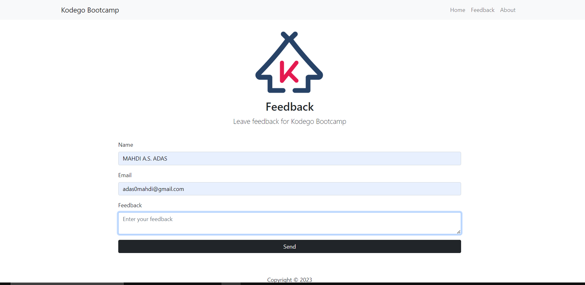
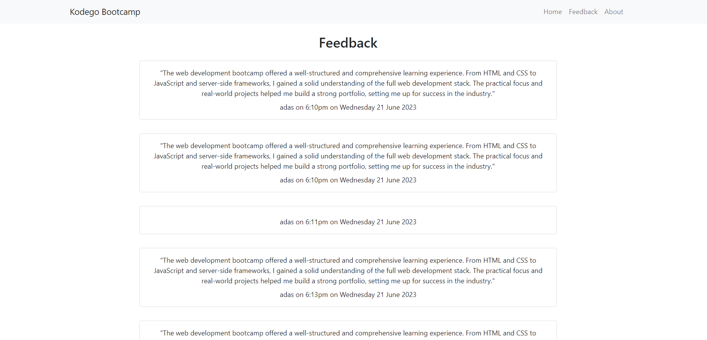
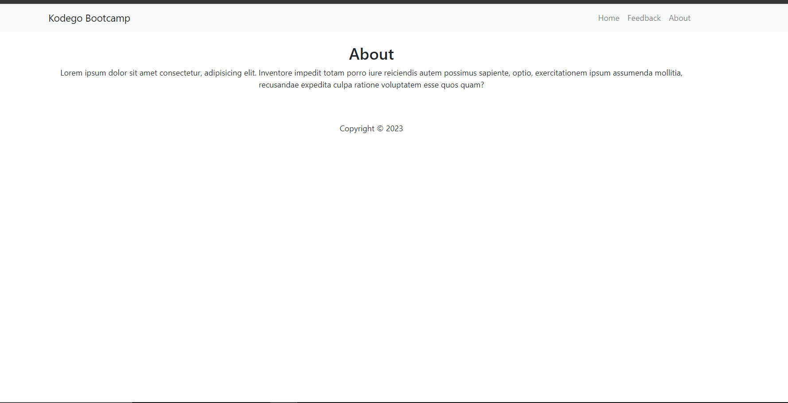
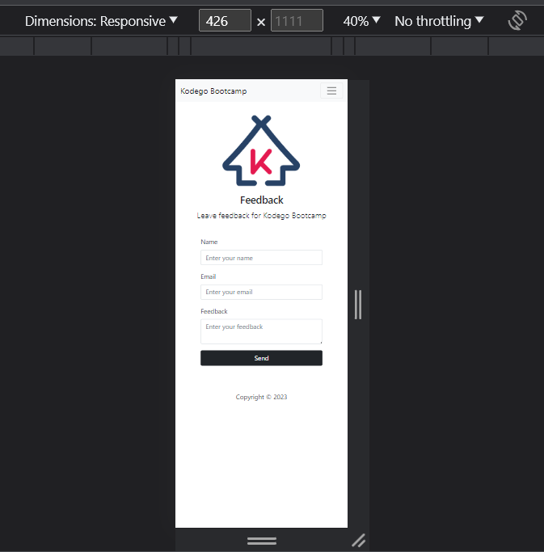

# Feedback.php

Feedback.php is a simple web application that allows users to submit feedback using a form. It is built using PHP and HTML, providing an easy way to collect user feedback and store it for further analysis.

## Features

- User-friendly feedback form with fields for name, email, and message.
- Basic form validation to ensure required fields are filled and email address is valid.
- Submitted feedback is stored in a text file for later reference.

## Prerequisites

To run the Feedback.php project, you need to have the following:

- A web server (such as Apache or Nginx) installed on your local machine or hosting environment.
- PHP 5.6 or higher installed on the server.

## Installation

- Clone the repository to your local machine or hosting environment:

   ```shell
   git clone https://github.com/adas0mahdi/feedback.php.git

1. Configure your web server to point to the project directory. For example, if you're using Apache, you can create a virtual host or place the project files in the web server's document root.

2. Ensure that the web server has write permissions for the feedback.txt file. This file will store the submitted feedback.

<h2> :hammer:Usage </h2>
1. Access the feedback form through your web browser using the appropriate URL. For example, if you're running the project locally, the URL might be http://localhost/feedback.php.

2. Fill in the required fields (name, email, and message) and click the "Submit" button to submit the feedback.

3. The feedback will be stored in the feedback.txt file located in the project directory.

<h2>🍩:Customization</h2>
1. You can customize the design and layout of the feedback form by modifying the HTML and CSS code in feedback.php.
2. If you want to store the feedback in a different format or location, you can update the code in submit_feedback.php accordingly.


<h2>🔥: License </h2>
This project is licensed under the MIT License.
Feel free to modify and adapt the code according to your needs. Contributions are welcome!
<br>
<br>
<br>
 
. 






